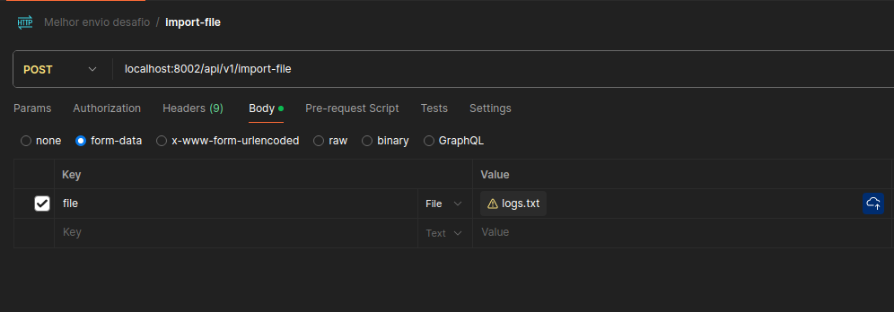
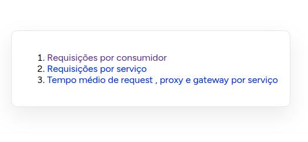

# Desafio Melhor Envio - Projeto Laravel
## Descrição
Este projeto é parte do desafio de desenvolvimento para a Melhor Envio. A aplicação, construída com PHP/Laravel, é responsável por importar e processar logs JSON de um sistema de API Gateway, armazenando-os em um banco de dados e gerando relatórios específicos.

## Requisitos
- Docker
- Docker Compose

## Como Executar o Projeto

### 1. Clonar o Repositório
   Clone o repositório do projeto para sua máquina local:

``
git clone https://github.com/Wasgton/melhor-envio-desafio-backend.git
``
``
cd melhor-envio-desafio-backend
``

### 2. Executar com Docker
   O projeto foi configurado para iniciar os containers, instalar as dependências e realizar todas as configurações necessárias com um único comando:

`docker compose up`
- Para versões antigas do Docker Compose, utilize:
`docker-compose up`

### 3. Acessar a Aplicação
   Após a execução do comando acima, a aplicação estará disponível no endereço:
http://localhost

##  Funcionalidades
### 1. Importação de Logs JSON
- Leitura e importação de arquivos de log JSON com grandes volumes de dados.
- Inserção dos dados no banco de dados de forma otimizada.
### 2. Geração de Relatórios
- Geração e exportação dos relatórios em formato CSV.

## Testes

### Executar os Testes automatizados
 Para executar os testes, siga os passos abaixo:

- Entre no container do PHP:
``docker compose exec php bash``
- Dentro do container, execute o comando:
``php artisan test``

### Testes Manuais
#### Importar Arquivos
Para importar o arquivo, foi criada a rota:
``/api/import-file``

1 - Envie uma requisição POST para a rota acima com o arquivo anexado no parâmetro file.
Exemplo:

#### Exportar Relatórios
Foram criadas três rotas para gerar e baixar os relatórios em CSV:

- Relatório de requisições por consumidor:
  - http://localhost/report/consumer
- Relatório de requisições por serviço:
   - http://localhost/report/service
- Relatório de tempo médio de request, proxy e gateway por serviço:
   - http://localhost/report/latency
- Além disso, há uma página web com links para baixar os relatórios:
  - http://localhost/

